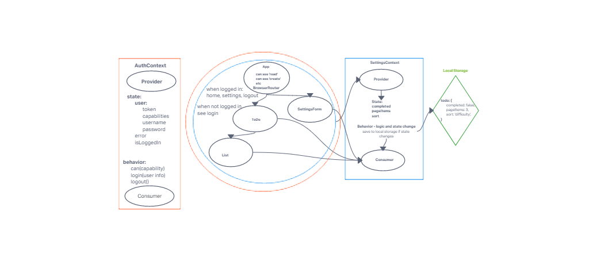

# LAB - 33

## Context API
- In Phase 3, we’d like to extend the functionality of the application by requiring users be logged in to view items and also restrict access based on user type. The user stories from Phases 1, and 2 remain unchanged. For this phase, we are now adding the following new user stories.

- As a user, I want to provide a way for other users to create new accounts
- As a user, I want to provide a way for all users to login to their account
- As a user, I want to make sure that my To Do items are only viewable to users that have logged in with a valid account.
- As a user, I want to ensure that only fellow users that are allowed to “create”, based on their user type, can add new To Do Items
- As a user, I want to ensure that only fellow users that are allowed to “update”, based on their user type, can mark To Do Items complete
- As a user, I want to ensure that only fellow users that are allowed to “delete”, based on their user type, can delete new To Do Items
### Author: Abdinasir Yussuf

- [submission PR](https://github.com/tutuorial-401js/class-00)

#### Running the app

- `npm start`

#### Tests

- Unit Tests: `npm run test`

#### 
- uml example from class will create my own for better understanding
